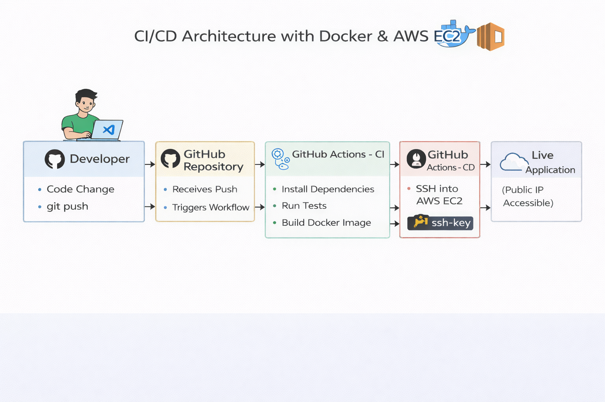

# 🚀 End-to-End CI/CD Pipeline Deployment on AWS

Production-ready containerized Flask application with fully automated CI/CD pipeline using GitHub Actions, Docker, DockerHub, and AWS EC2.

---

## 📌 Project Overview

This project demonstrates the implementation of a complete CI/CD automation pipeline for deploying a Dockerized Flask application to AWS EC2.

On every push to the `main` branch:

- Automated tests run
- Docker image builds
- Image pushes to DockerHub
- GitHub Actions connects to AWS EC2 via SSH
- EC2 pulls latest image
- Old container stops
- New container starts automatically

Zero manual production login required.

---

## 🧩 Problem Statement

Manual deployments are:

- Error-prone
- Time-consuming
- Inconsistent
- Not scalable

Many small projects rely on:
- Local builds
- Manual server access
- Manual container restarts

This project solves that by implementing a fully automated CI/CD workflow.

---

## 🏗 Solution Architecture

### Deployment Workflow
Developer → GitHub → GitHub Actions (CI)
→ Build Docker Image → Push to DockerHub
→ GitHub Actions (CD) → SSH into EC2
→ Pull Latest Image → Restart Container → Live Application

---


## 📊 Architecture Diagram 

```markdown

---